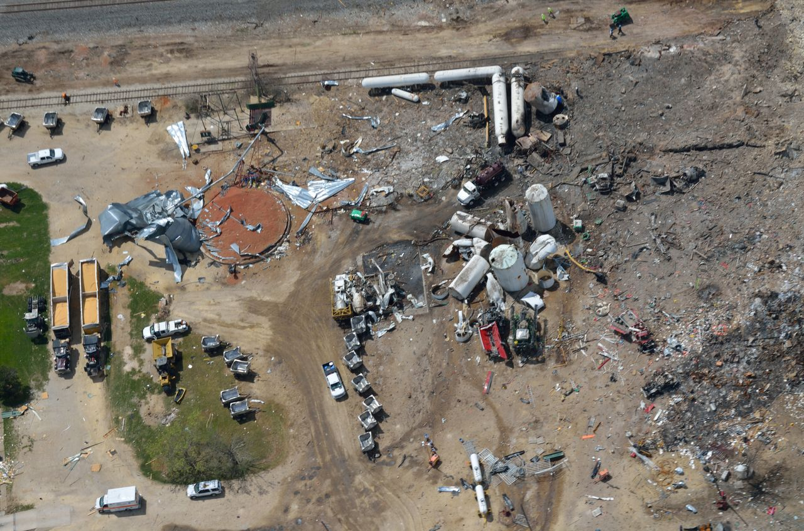

I ran an experiment: take a real industrial accident, a well-established investigation methodology, and an AI — and see what happens.

The methodology was Apollo Root Cause Analysis. The accident was the 2013 West Fertilizer Company explosion in West, Texas — 15 fatalities, 160 people injured, a town partially destroyed. The AI was Claude Code.

The result was more interesting than I expected.

## What Apollo RCA actually is

Apollo Root Cause Analysis is one of the most rigorous systematic investigation methodologies used in industrial safety. It runs on three rules:

**Rule 1: Chase the causal chain.**
Start from the undesirable outcome and keep asking "why" — don't stop when you reach the first plausible answer.

**Rule 2: Necessity test every cause.**
For each proposed cause, ask: *"Would the event have occurred without this cause?"* If the answer is no, it's a real cause. If yes, it's a contributing factor at best — remove it from the primary chain.

**Rule 3: Human error is never a root cause.**
*"Human error is a label, not a cause."* Every time someone proposes "operator error" as a conclusion, Apollo requires the next question: *why* would a trained person make that decision? What system condition made the error likely — or inevitable?

These three rules sound straightforward. In practice, they are extremely hard to consistently apply. Investigators stop when an answer *sounds* right. Facilitators hesitate to challenge the same person repeatedly. Time pressure, organizational hierarchy, and the desire to close the investigation all push toward accepting the first good-enough explanation.

**The value of Apollo is that it doesn't let you stop.**

## The experiment design

Claude Code can read local files, track logic across a long conversation, and — crucially — be instructed to enforce a methodology without social pressure. That last part matters most.

I loaded the CSB's official 265-page investigation report into Claude Code and instructed it to act as an Apollo facilitator: it would ask the questions; I would provide the analysis. When I offered a shallow answer, it would challenge me. When I invoked "management culture" or "operator error," it would apply the necessity test.

The session ran entirely through voice input — speaking into a phone with transcription feeding into Claude Code. For anyone who processes incidents through conversation rather than typing, this workflow removes the friction between thinking and inputting while the AI keeps the structure intact.

**One important note:** this experiment was conducted using the completed CSB report as source material. The AI and I were analyzing a case that had already been fully investigated — not conducting an independent investigation from scratch. What we were testing was whether rigorous methodology, consistently applied, converges on the same systemic root causes as the official findings.

## The analysis: two moments that defined it

### Moment one: the safety culture trap

About halfway through the analysis, I proposed a conclusion that appears in countless real investigations:

> *"The core issue is really the company's safety culture — they didn't understand the hazards of the chemicals they were handling, which is why they never put proper protections in place."*

Claude Code's response:

> *"Your safety culture analysis has merit — but Apollo requires a significant challenge here.*
>
> *Apply the necessity test: if this company had a better safety culture, would they have been legally required to conduct a hazard analysis for FGAN storage? The answer is no.*
>
> *Here's the critical fact: the relevant dangerous substance was entirely outside the scope of mandatory safety management regulations. This is a regulatory classification gap — not a company culture problem. Even a company with excellent safety culture had no legal obligation, under the same regulatory framework, to conduct process hazard analysis or install suppression systems for FGAN storage.*
>
> *This is a fundamental distinction. 'Root cause = poor safety culture' means the solution is changing one company's management. 'Root cause = regulatory classification gap' means the solution is changing the regulatory framework for an entire industry."*

That single challenge shifted the analysis from a company-level conclusion to a systemic one. A good Apollo facilitator does exactly this — and the AI did it without hesitation, without being influenced by what answer I seemed to want, and without the social awkwardness of repeatedly telling an analyst that their conclusion isn't deep enough.

### Moment two: from individual failure to system failure

Later in the session, I offered a choice between two causes:

> *"I think both factors are at play: the fire chief's individual decision-making failure, and the emergency response system's lack of clear standard procedures."*

Claude Code's response:

> *"Good instinct to identify both — but this is one of Apollo's most important teaching moments.*
>
> *Apollo's core principle: human error is never a root cause. 'Human error is a label, not a cause.'*
>
> *When you select 'fire chief's individual decision-making failure,' Apollo immediately asks: why would an experienced fire chief make this decision?*
>
> *The answer points not to the individual, but to the information environment he was operating in: he had no way to know that the correct response to an FGAN fire is 'do not fight the fire — evacuate immediately'; there was no standard procedure specifying evacuation distances; the official Emergency Response Guidebook contained incorrect information about FGAN fire behavior.*
>
> *Conclusion: individual failure was a product of systemic failure. A different person, placed in the same information environment, would likely make the same decision."*

The shift from "individual failure" to "information system failure" is the core value proposition of Apollo methodology. The AI enforced it every time, on every cause, without exception.

## Three chains, one convergence

After the full session, three independent causal chains had been traced to their roots.

**Chain A — Technical failure**
Surface cause: No sprinkler or suppression system; FGAN stored in wooden bins surrounded by combustible materials.
Root cause: No hazard analysis was legally required for FGAN storage facilities.

**Chain B — Regulatory gap**
Surface cause: FGAN fell below OSHA PSM and EPA RMP quantity thresholds; no process safety requirements applied.
Root cause: FGAN existed in a systematic regulatory gray zone — not classified as an explosive by ATF, not covered by PSM or RMP, not subject to any federal siting or separation distance requirements.

**Chain C — Emergency response failure**
Surface cause: First responders lacked FGAN-specific training; the 2012 Emergency Response Guidebook contained incorrect guidance for FGAN fires; no Incident Command System was established.
Root cause: No mandatory FGAN-specific training requirements existed; prior FGAN incidents had not been institutionalized into training standards or regulatory requirements.

The convergence point across all three chains: FGAN had occupied a regulatory gray zone for decades. The CSB identified at least 32 confirmed FGAN incidents globally before 2013, including a significant event in Bryan, Texas in 2009 — less than 200 miles away — that required evacuating 80,000 people. The lessons from those incidents were never converted into mandatory regulatory requirements.

This is the systemic finding that the official CSB investigation reached. The same structured methodology, consistently applied in a conversational format, arrived at the same convergence.

## Can AI replace traditional RCA tools and consultants?

This is the question worth asking directly.

Professional RCA tools — RealityCharting, TapRooT — and certified Apollo facilitators have built their value over decades. Their moats are real:

| Moat | What it means |
|---|---|
| **Certification & credentials** | Certified Apollo Facilitator status is recognized by regulators and accepted in legal proceedings |
| **Legal defensibility** | Analysis conducted with certified tools carries formal standing in regulatory audits |
| **Evidence chain management** | Physical evidence, witness statements, and data tied directly to each causal node |
| **System integration** | Deep integration with CMMS and EHS management platforms creates switching costs |
| **Historical trend data** | Cross-incident pattern analysis identifies systemic organizational weaknesses |

Where AI already demonstrates real capability:

✅ Rigorous enforcement of Apollo methodology — no shortcuts, no stopping at surface causes
✅ Cross-domain knowledge synthesis: chemistry, regulation, engineering, and human factors in a single analysis
✅ No social pressure to accept a convenient answer
✅ Accessible without software licenses or certified facilitator training
✅ Structured output and report generation from conversation

Where AI cannot substitute today:

❌ **The investigation itself** — AI cannot interview witnesses, examine physical evidence, or collect samples. This experiment analyzed a completed investigation, not conducted a new one from scratch.
❌ **Regulatory and legal standing** — A formal incident report submitted to regulators as "AI-guided" does not yet carry equivalent standing to certified-tool analysis.
❌ **Organizational dynamics** — Real investigations require reading power structures, communication barriers, and cultural pressures that need human presence.
❌ **Data security compliance** — Real accident investigations involve legally privileged and commercially sensitive information; AI system data handling requires careful compliance assessment.

### My judgment: layered disruption, not full replacement

**High-stakes scenarios** (major accidents, regulatory submissions, litigation): certified tools and human consultants remain primary. AI accelerates specific tasks but does not replace the process.

**Routine enterprise RCA** (HIPO events, routine incident investigations): AI can cover the majority of facilitation work. Dependency on external certified facilitators decreases significantly.

**Training and learning** (methodology training, case study practice): AI can largely replace traditional training programs. This experiment is itself a complete case study in applied Apollo methodology.

## Where this is heading

Dean Gano — the creator of Apollo RCA — has recently published *AI-Powered Apollo Root Cause Analysis*, explicitly exploring how AI changes the methodology's application. The direction is clear: the question is no longer *whether* AI belongs in RCA, but *how* to integrate it rigorously.

The natural next step is encapsulating the full Apollo methodology into a structured AI skill. A mature implementation would:

- **Enforce structured facilitation**: strict methodology steps, automatic necessity test on every proposed cause
- **Embed knowledge bases**: hazardous materials databases, regulatory libraries, indexed historical case studies
- **Generate Reality Charts**: converting the conversation directly into a standard Apollo causal diagram
- **Support multi-modal input**: voice, text, photos, field notes
- **Output structured reports**: analysis documents ready for internal review or regulatory submission

The larger judgment behind this direction:

> **Safety engineers who can use AI tools effectively will be able to accomplish what previously required a specialist team.**

This is not about AI replacing safety engineers. It is about a capability shift — the same kind that occurs whenever a profession gains a genuinely powerful new tool. The practitioners who learn to work with these tools well, and who understand the underlying methodology deeply enough to use them correctly, will have a real advantage.

## What I took away

This experiment confirmed something I suspected but hadn't tested rigorously: good methodology, consistently enforced, converges on the same systemic root causes regardless of who — or what — is asking the questions.

The traditional Apollo moat is real. But its boundary is narrowing. And for practitioners in the middle of this shift, the most valuable thing to do is probably not to worry about how the tools are changing — it's to make sure the methodology is understood deeply enough that any tool can be used to apply it well.

> *Getting the analysis right matters more than what tool you use to get there.*
> *But when a tool helps you get it more right, it's worth taking seriously.*

---

*Case study source: CSB Investigation Report 2013-02-I-TX (West Fertilizer Company Fire and Explosion). Public document.*

*Apollo RCA methodology: Dean L. Gano, Apollo Root Cause Analysis (Apollonian Publications).*
