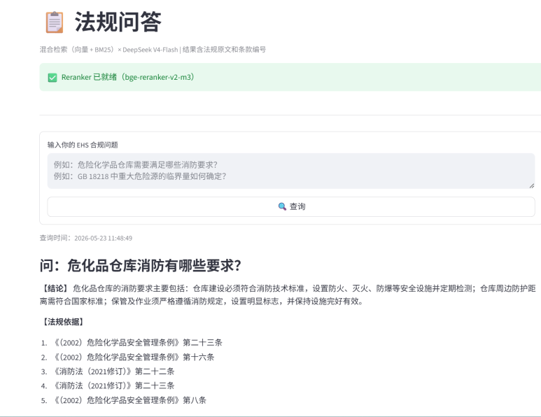
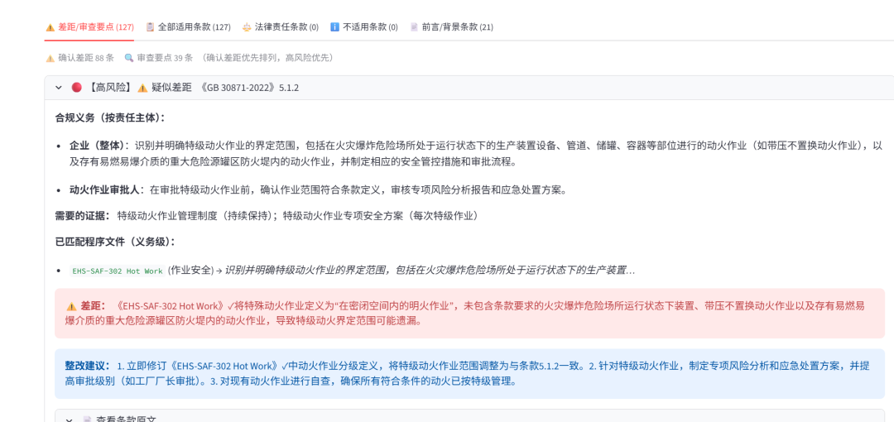
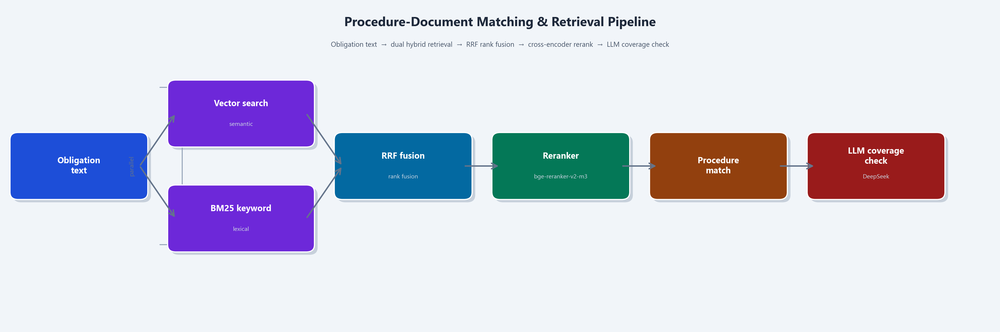
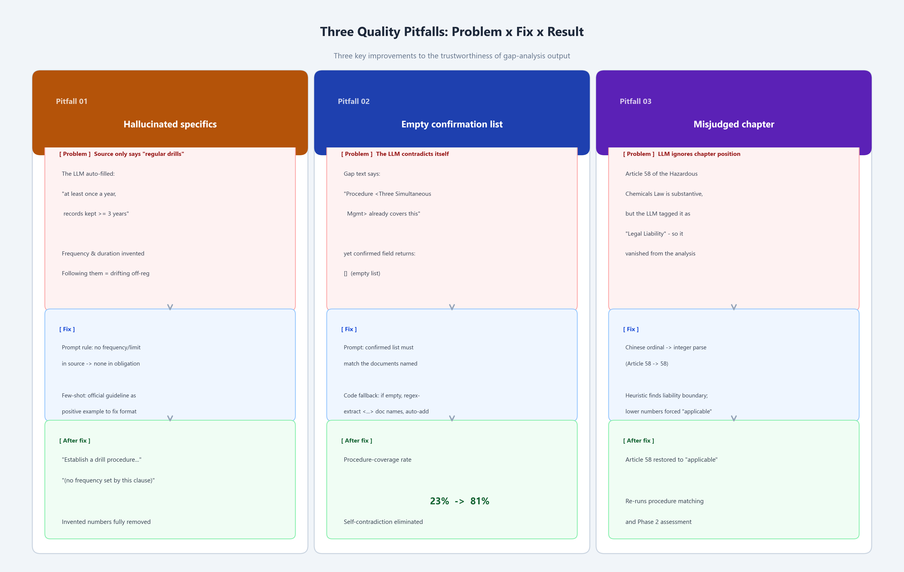
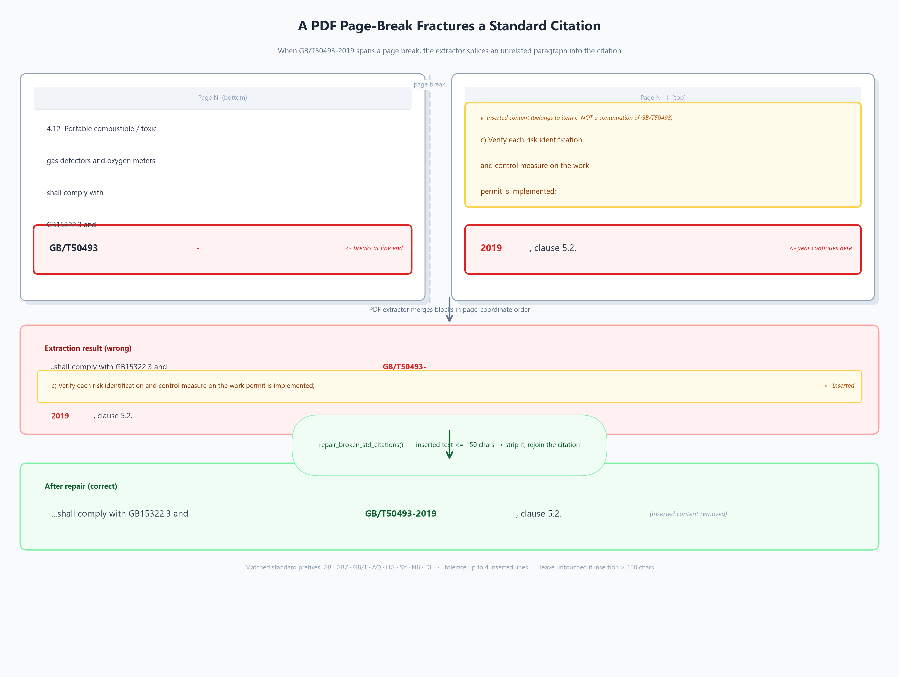
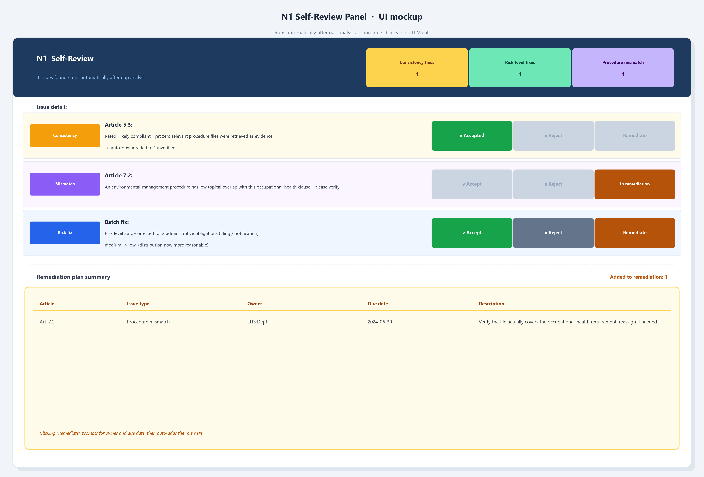

I've been building an AI system to change how manufacturing companies manage EHS (Environment, Health & Safety) compliance in China.

It started with a simple question: can AI meaningfully reduce the manual burden of cross-referencing hundreds of regulatory articles against dozens of internal procedure documents? After months of development the answer is *yes* — but the path required rethinking the architecture several times, and filling a long series of engineering potholes that only show up once real documents hit the system.

Here's the full story.

## The problem

EHS compliance in Chinese chemical manufacturing is document-intensive by nature. A mid-sized plant may be subject to 20+ national and local regulations, each containing dozens of articles — and must demonstrate compliance through an equally large internal library of procedure documents, management systems, and records.

The traditional workflow: compliance professionals manually map regulations to procedures, identify gaps, and write remediation plans. It's slow, expertise-dependent, and almost impossible to keep current as regulations are revised.

**The opportunity for AI is not to replace compliance judgment, but to handle the first pass automatically.**

## V1: Regulation Q&A

The first version established the retrieval foundation.

A compliance professional could type a natural-language question — *"What are the fire safety requirements for hazardous chemical storage?"* — and receive a structured answer citing specific regulatory articles, with their original Chinese text and legal hierarchy.

What made this non-trivial:

- **20 EHS regulations** fully ingested into a ChromaDB vector store.
- **Hybrid retrieval**: semantic vector search (BGE-M3) fused with BM25 keyword search (rank-bm25 + the jieba Chinese tokenizer) via Reciprocal Rank Fusion.
- **Cross-encoder reranking**: BGE-Reranker-v2-m3 for final precision scoring.
- **Structured output**: every answer cites source regulation, article number, law hierarchy level, and full original text.

Two of those steps lean hard on a local GPU, and pull the GPU out and they simply stop working:

**Scanned-PDF OCR.** Many Chinese national standards — including GB 30871 — are scanned PDFs with no text layer. Read directly, PyMuPDF returns blank pages. To ingest them at all, you need OCR. I run PaddleOCR (the PP-OCRv5 server model) on the GPU; compared to the EasyOCR setup I started with, recognized text blocks for GB 30871 went from 108 to 129 — the missing clauses came back. There's a catch: PaddleOCR uses the PaddlePaddle framework and the reranker uses PyTorch, and **both want exclusive control of the CUDA context** — together in one process they crash. The fix is to run PaddleOCR in an isolated Python 3.12 subprocess and hand results back to the main (PyTorch) process through a file.

**Reranking.** After RRF fusion, candidate clauses still need pairwise rescoring. A cross-encoder concatenates the query with each candidate and runs the whole thing through the model — several times the compute of the retrieval itself. On CPU a single query takes seconds; on an RTX 5070 it finishes in milliseconds and the user feels nothing.

V1 solved "finding regulations." But that's not where compliance work actually gets stuck. Professionals don't struggle to *find* the law. They struggle to answer: **"Are we actually meeting it? Where exactly are we falling short?"**

## V2: Bridging regulations and internal procedures

Building the gap-analysis capability required three progressively deeper layers.

### Layer 1 — Regulatory framework

First, the infrastructure for structured analysis:

- **Regulation Library**: browse all ingested regulations, filter by legal hierarchy (National Law → Administrative Regulation → Ministerial Rule → National Standard), send selections to analysis.
- **Factory Profile**: capture company-specific context (industry, scale, processes, hazardous materials, existing licenses) — context shapes what's applicable.
- **Applicability Engine**: for each article, decide *directly applicable* / *conditionally applicable* (only during new construction, renovation, incidents) / *not applicable*.

The three-value applicability design matters: regulations about new construction shouldn't generate gap findings for a plant with no active construction. Context-aware applicability cuts noise dramatically.

### Layer 2 — Obligation-level extraction

The first gap-analysis outputs were structurally correct but practically useless. Asked about a confined-space regulation, the system would produce:

> *"The company should strengthen confined space management procedures."*

Technically accurate. Also something every EHS professional already knows without AI.

**The architectural shift: from article-level to obligation-level analysis**, via a two-phase LLM pipeline.

**Phase 1 — Obligation extraction.** For each article, the LLM extracts specific, actionable obligations and maps them to responsible roles (primary responsible person, safety management personnel, line workers, the company as a whole), separating routine obligations from conditionally-triggered ones. A JSON schema constrains the output to fixed fields, so the model can't free-associate.

This produces an obligation inventory — not "the company must comply with Article 18" but "the Safety Manager must establish a documented pre-entry gas testing procedure for confined spaces, with records retained."

**Phase 2 — Evidence-based assessment.** For each obligation, the system independently searches the company's procedure library, retrieves the most relevant evidence, and asks the LLM a targeted question: does this document actually cover this requirement? Output is now grounded in specific evidence:

> *"Procedure EHS-SAF-301 (General Work Permit) does not include pre-entry atmospheric testing requirements for confined spaces. This is a critical obligation gap. Recommended action: Safety Manager to revise EHS-SAF-301 to add multi-point gas detection with mandatory sign-off before entry."*

### Layer 3 — The procedure library (and the first pothole)

Getting to obligation-level matching required a full procedure-document module: ingestion, change detection, one-click re-indexing.

Then the first surprise. Forty procedure files were uploaded; four ingested successfully. The other 36 `.doc` files **weren't Word documents at all** — they were Office theme packs (colors and fonts, no body text). The lesson, learned the hard way: a file extension is not file content. The ingester now checks magic bytes, not the extension, and skips files with no real body.

## The semantic-search blind spot

Article 18 of China's Hazardous Chemicals Safety Law requires new construction projects to be located inside designated chemical industrial parks — a *site-selection* requirement.

The company has a procedure called the *"Three Simultaneous" Management System* (三同时), governing safety facilities built concurrently with the main project. Directly relevant. The vector search **missed it completely.**

"Site selection compliance" and "Three Simultaneous construction management" have low cosine similarity in embedding space — even though any experienced EHS professional connects them instantly. This is the fundamental limit of pure semantic search: it finds what's *similar in meaning*, not always what's *relevant in practice*.

The fix was to mirror the hybrid architecture already proven on the regulation side: add BM25 keyword retrieval to procedure search, fuse with RRF, rerank with the same cross-encoder. The keyword "三同时" now gets an exact BM25 hit, rescued from the semantic blind spot. Then one more layer — the Phase 2 LLM explicitly confirms which retrieved documents actually cover the obligation, so hazardous-waste procedures stop appearing as evidence for major-hazard obligations just because their vectors overlap.

## The last-mile quality problems

Getting the architecture right was necessary but not sufficient. Three subtle output-quality problems each needed their own fix.

### Problem 1 — Obligations that sound authoritative but aren't

Early obligation extraction produced things like:

> *"The safety manager must organize emergency drills at least once per year and retain drill records for a minimum of three years."*

Both the frequency and the retention period were fabricated. The regulation says "conduct regular drills" — no interval. The LLM was filling gaps with plausible-sounding requirements from its training data.

In compliance, this is dangerous: an auditor who builds a program around phantom requirements leaves the real ones unaddressed. **Fix:** an explicit rule — *only write a frequency or time limit if it appears verbatim in the regulation text* — plus few-shot examples from official Chinese safety-management guidelines. The output shifted from "paraphrase the regulation" to "describe the procedure the company needs to build":

> *"Establish a documented emergency-drill procedure covering drill scenarios, participant records, and post-drill assessment. [No specific frequency prescribed in this article.]"*

### Problem 2 — "Confirmed" procedures that weren't

Phase 2 has a `procedures_confirmed` field — the LLM's explicit list of which documents cover each obligation. The problem: it would write "Procedure EHS-GEN-118 (Three Simultaneous Management) covers this requirement" in the gap text, and simultaneously return `procedures_confirmed: []`. The prose contradicted the structured field.

**Fix:** a consistency rule (if the gap text names a document, it must appear in the confirmed list) plus a code-level fallback that extracts document names from `《》` brackets when the list is empty but status is `likely_compliant`. Procedure-coverage rate in assessed articles went from ~23% to 81%.

### Problem 3 — Regulatory-structure blindness

Chinese regulations are organized into numbered chapters; the "Legal Liability" chapter — purely punitive — is typically last (in the hazardous-chemicals law, from Article 98). Reading only article text, the LLM occasionally classified mid-regulation articles containing incidental penalty references as "legal liability" provisions, removing them from analysis entirely.

**Fix:** a post-Phase-1 code validation step. A Chinese ordinal-to-integer parser (`第五十八条` → `58`) finds the lowest article number that is *definitively* in the liability chapter; any lower-numbered article misclassified as a penalty gets reclassified before procedure matching proceeds. No database changes — the correction happens entirely in the pipeline.

## An interlude: borrowing ideas, not code

With those filled, the system worked. But one risk nagged at me: **the quality of the regulation text going into the store in the first place.**

I came across an open-source project, [opendataloader-pdf](https://github.com/opendataloader-project/opendataloader-pdf), built for structured PDF extraction. My first instinct was to adopt it. After studying it, I decided *not* to — it's a heavy dependency with its own model weights and runtime that would complicate version management and likely clash with my GPU stack.

But its design thinking was worth stealing. Three insights:

1. **A table is a table, not scattered text.** Naive extraction turns a 3×10 permit-requirements table into thirty loose fragments mixed into the body, semantically meaningless once vectorized. Identify the table region first; each row is one semantic unit.
2. **Documents have hierarchy.** Chapter titles, article numbers, and body text carry different weight. Read font sizes — large → heading, small → body — and preserve the structure.
3. **Chunk on semantic boundaries.** A fixed 1,500-character cut splits clauses in half. Prefer clause boundaries; treat the character limit as a fallback ceiling, never a mid-sentence guillotine.

I implemented all three with the PyMuPDF I already had. **Zero new dependencies.** Table-awareness shipped first; hierarchy and semantic chunking are folded into the next iteration.

## The PDF page-break that fractured a citation

While reworking extraction, I found a stranger problem in GB 30871. Clause 4.12 displayed like this:

> *"…应符合GB15322.3和GB/T50493— c）应核查安全作业票中各项风险识别及管控措施落实情况。 理要求情况；2019中5.2的要求。"*

Not garbled text — a physical page-layout artifact. The standard reference `GB/T50493—2019` happened to span a page break: the page ended with `GB/T50493—`, the next page rendered an unrelated paragraph first (`c) …`), and only then the year `2019…`. Reading by coordinate order spliced the unrelated paragraph straight into the citation. Scanning all of GB 30871, 3 of 226 text blocks (1.3%) had this defect.

**Fix:** at the cleaning stage, a regex detects the pattern *standard-number at line end → 1–4 inserted lines → year continuation*, and if the insertion is under ~150 characters it's removed and the citation restored. The extraction logic is now its own module, reusable for procedure PDFs too.

## Teaching the system to review itself

The most recent layer is the one I'm most pleased with: **a self-review agent (GapReviewAgent)** that runs after the AI finishes but before results reach the user. Crucially, it's a **pure rule engine — no LLM call, zero added hallucination risk**, running in milliseconds and fully decoupled from the analysis pipeline.

It checks three things:

1. **Consistency.** An article rated *likely compliant* while the system found *zero* relevant procedure files is illogical — on what basis is it compliant? Such articles are downgraded to *unverified*, with the reason noted.
2. **Procedure mismatch.** An environmental-monitoring procedure matched to an occupational-health clause, say. The file was found, but in the wrong domain. The agent compares each procedure's source category (environment / occupational health / safety) against the clause topic and flags suspected mismatches.
3. **Risk-distribution skew.** If *low risk* is under 5% of a batch — almost everything rated medium or high — that's more likely prompt bias than a uniformly hazardous plant. Purely administrative obligations (filing, reporting, notification) are corrected down to low risk.

And a deliberate boundary: **the agent recommends; it does not silently edit.** Every flag gives the compliance professional three actions — *accept* (apply the correction), *reject* (restore the original), or *add to remediation* (record an owner and due date). Clicking a flag jumps straight to the corresponding gap entry for cross-checking. The same stance carries into the evidence-audit agent that reviews remediation proof: it audits submitted evidence from an auditor's posture, and when it can't verify the original document, it refuses to auto-close the gap — it parks it as *partially satisfied, pending human confirmation*. The AI can find a gap and check the paperwork; it can't vouch for an original it can't see.

## What the system does today

| Capability | Status |
|---|---|
| Regulation Q&A with citations | ✅ |
| Regulation library (browse, filter, select) | ✅ |
| Factory profile | ✅ |
| Procedure library (ingest, change detection) | ✅ |
| Gap analysis — obligation-level matching | ✅ |
| Obligation quality controls (no hallucinated specifics) | ✅ |
| Procedure-confirmation consistency | ✅ |
| Legal-liability chapter detection | ✅ |
| PDF table structuring | ✅ |
| Cross-page citation repair | ✅ |
| Self-review (consistency / mismatch / risk skew) | ✅ |
| Human adjudication (accept / reject / remediate) | ✅ |
| Compliance-rate dashboard | 🔄 In development |

## Where it's going

- **Procedure-quality scoring into gap analysis** — today it checks *whether* a procedure was found; next, *how good* the found file is, downgrading low-quality matches even when they hit.
- **An active coordination layer** — wrapping ingestion QC, the analysis workflow, and the review agent into one orchestrator that intervenes rather than just validates: bad input blocks analysis, flawed output is corrected before the user sees it, and summary numbers are computed by the harness rather than self-reported by the LLM.
- **Auto-selecting regulations** — instead of the user picking one regulation per run, an agent reads the factory profile and decides which regulations to check, running many analyses in parallel for one complete report.
- **Regulation version diffing** — when a regulation is revised, automatically surface the added / changed / removed clauses for targeted re-review.

## The design philosophy

The insight driving the whole project: **compliance work has two distinct cognitive modes.**

The first is *retrieval* — finding the relevant regulation, the applicable article, the specific obligation. AI can take this over almost entirely.

The second is *judgment* — deciding whether a documented procedure actually meets the spirit of the requirement, assessing real-world risk, making calls under ambiguity. This requires human expertise and cannot be automated.

The goal was never to replace compliance professionals. It's to collapse the time spent on the first mode — from days of manual research to minutes of AI-assisted analysis — so their expertise can focus entirely on the second.

A system that *sounds* helpful is easy to build. A system that's actually useful to an EHS professional requires getting the obligation extraction right, the retrieval architecture right, and the verification layer right. That's what this project has been about — and it's still on the road, with the direction getting clearer the further it goes.

---

*If you're working on AI for EHS, HSE, or regulatory compliance — or building RAG systems for specialized domains — I'd welcome the conversation.*
