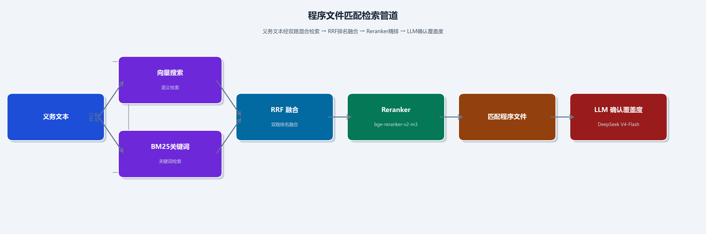
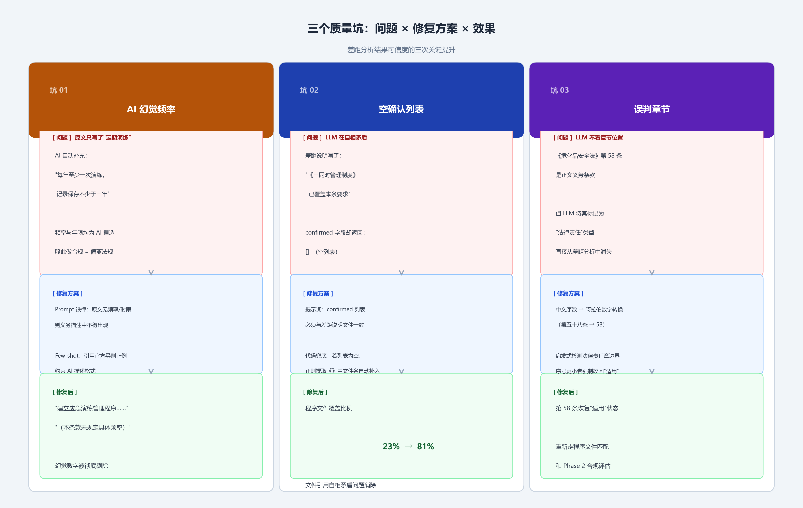
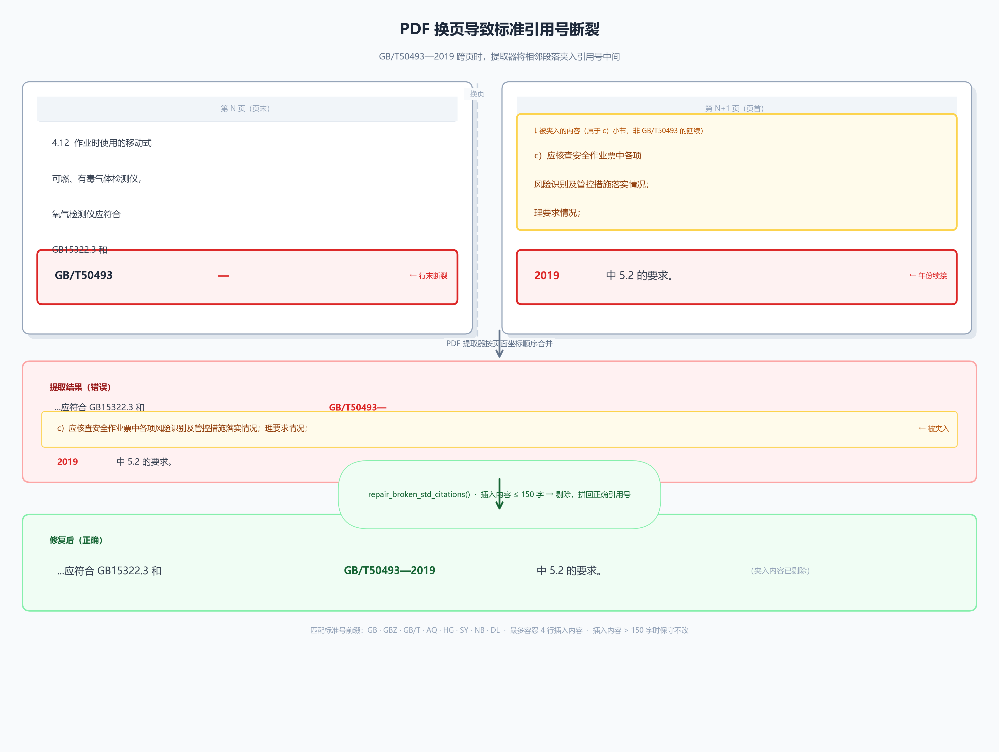
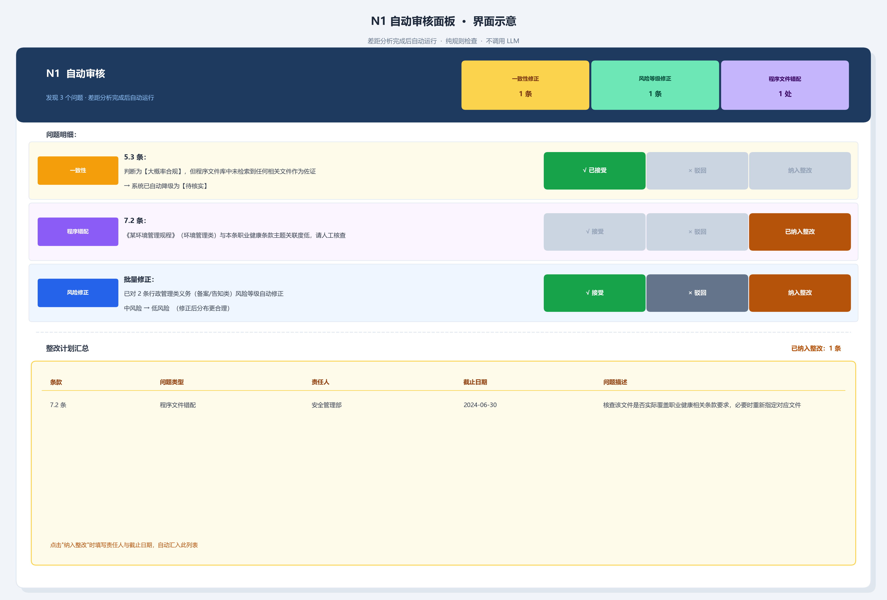
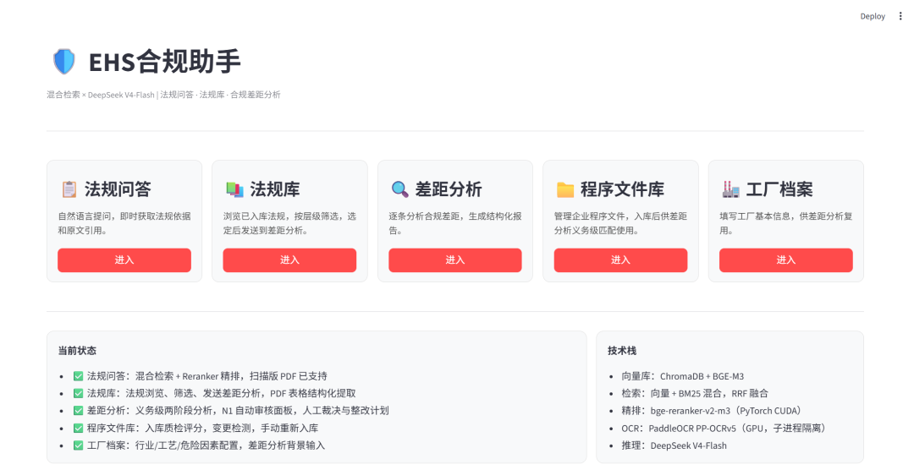

我一直在做一件事：让 AI 真正帮上 EHS 合规工作的忙。

不是泛泛地"询问法规"，而是能直接告诉你——**你的企业，哪条法规，哪份程序文件，缺什么。**

这是这个系统的进化历程，也是一路填过的一长串工程坑。

## V1：能提问，能引用

最初的版本，核心功能只有一个：**法规问答**。

你问：「危险化学品仓库的消防要求是什么？」它答：引用具体法规条款，附原文，注明法规层级。

技术上这已经不简单：

- 20 部 EHS 法规全文向量化入库（含扫描版 PDF 的 OCR 识别）
- 混合检索：语义向量（BGE-M3）+ BM25 关键词，RRF 融合排序
- Reranker 精排：确保最相关条款优先
- DeepSeek 推理，严格基于原文回答

其中有两个环节依赖 GPU 加速，拿掉 GPU 这两步就跑不动：

**① 扫描版 PDF 的文字识别。** 许多中国国家标准（包括 GB 30871）是扫描版 PDF，没有文字层，PyMuPDF 直接读出来是空页。要入库就必须 OCR。我用 PaddleOCR（PP-OCRv5 server 级模型）跑 GPU 推理。对比之前用的 EasyOCR，GB 30871 识别出的文本块从 108 个涨到 129 个，漏掉的条款内容找回来了。这里有个麻烦：PaddleOCR 用 PaddlePaddle 框架，Reranker 用 PyTorch，**两套框架都想独占 CUDA 上下文**，放在同一个进程里会冲突崩溃。解法：PaddleOCR 跑在一个独立的 Python 3.12 子进程里，主进程通过文件取结果，互不干扰。

**② Cross-encoder 精排。** RRF 融合之后，候选条款还要 Reranker 逐对打分重排。bge-reranker-v2-m3 是 Cross-encoder 架构，要把"查询"和每条候选拼在一起过一遍模型，计算量是检索的数倍。CPU 上一次查询要好几秒；在 RTX 5070 上毫秒级完成，用户感受不到等待。

但问答只是起点。合规工作真正的痛点不是"查法规"，而是——**"我们有没有做到？差在哪里？"**

## V2 第一阶段：搭起"合规分析"的骨架

V2 开始搭建差距分析的基础架构：**法规库**（按层级浏览筛选、一键送分析）、**工厂档案**（行业、规模、工艺、危险因素，为分析提供背景）、**差距分析 v1**（逐条判断适用性，输出"适用 / 条件触发 / 不适用"）。

这个阶段系统已经能产出结构化报告，但输出质量还不够精准——给出的差距说明往往是：

> 「建议企业完善相关管理制度」

专业，但没用。

## V2 关键升级：从"条款级"到"义务级"

这是最重要的架构升级。

**之前**：一条条款 → AI 判断"适用 / 不适用" → 笼统建议。**现在**：两阶段分析。

**第一阶段——义务提取。** AI 读懂每条条款，拆解出具体义务，按责任主体分类（主要负责人 / 安全管理人员 / 从业人员 / 企业整体），并区分常规义务与条件触发义务（仅新建 / 改建 / 扩建时适用）。JSON Schema 约束输出格式，杜绝自由发挥。

**第二阶段——基于证据的合规评估。** 针对每条义务，在企业程序文件库里检索：找到了什么？找到的文件是否真正覆盖这条义务？最终输出变成：

> 「程序文件《EHS-SAF-301 General Work Permit》未明确规定受限空间作业前气体检测要求，构成关键义务缺失。建议：由安全管理人员修订该程序，增加入场前多点气体检测记录要求。」

**这才是合规人员能直接用的结论。**

## 第一个坑：文件不是文件

40 份程序文件上传，成功入库 4 份。排查发现：36 份 `.doc` 文件根本不是 Word 文档，是 Office 主题包（只有配色字体，没有正文）。重新另存为 `.docx`，问题解决。入库逻辑也改成按**魔数（magic bytes）**而非扩展名判断文件类型，正文缺失的直接报错跳过。

> 教训：文件扩展名不等于文件内容。

## 语义搜索的盲区

《危险化学品安全法》第十八条：新建项目须在化工园区内**选址**。企业有《**三同时**管理制度》，直接相关。结果：系统没找到这份文件。

原因——"选址合规"和"三同时"在向量空间里距离太远，语义不够近。这是纯语义检索的根本局限：它找的是"意思相近"，未必是"实践相关"。

解法：给程序文件检索也加上 BM25 关键词 + RRF 融合 + Reranker 精排，和法规检索管道对齐。"三同时"这个关键词现在精确命中。然后再加一层：Phase 2 的 LLM 明确确认哪些文件真正覆盖了义务，环保类程序不再因为向量相近就被当成危险源义务的证据。

## 三个藏得深的质量问题

框架搭好了，不代表结果可信。还踩了三个坑。

### 坑一：AI 自己补了不存在的要求

早期版本的义务提取会输出：

> 「安全管理人员每年至少组织一次演练，记录保存不少于三年。」

听起来专业——但法规原文只写了"定期演练"，频率和年限都是 AI 自己加的。在合规场景这是危险的：照着幻觉要求做合规，反而忘了法规真正要求什么。

**解法**：提示词里加一条铁律——原文没写频率或时限，绝对不允许写进义务描述。配合官方《安全风险隐患排查治理导则》的示例样本，义务描述从"转述法规"变成"告诉你该建什么制度"：

> 「建立应急演练管理程序，明确演练场景、参与人员记录和事后评估报告要求。（本条款未规定具体频率）」

### 坑二：程序文件"已确认"其实没确认

Phase 2 有个字段 `procedures_confirmed`，让 LLM 明确说哪些文件真正覆盖了义务。结果 LLM 在差距说明里写"《EHS-GEN-118 三同时管理制度》已覆盖本条要求"，`procedures_confirmed` 却返回空列表。自相矛盾。

**解法**：两层修复——① 提示词加一致性规则：正文提到哪个文件，确认列表里必须有它；② 代码兜底：若判定"大概率合规"但确认列表为空，用正则从差距文本的书名号里提取文件名。效果：适用条款中有程序文件覆盖的比例从 23% 提升到 81%。

### 坑三：正文条款被误判成"法律责任"

中国法规有章节结构。《危险化学品安全法》第九章（从第九十八条起）才是法律责任章节。但 LLM 只看条款文字、不看章节位置，会把第五十八条这种正文条款也归类成"法律责任"，直接从差距分析里消失。

**解法**：Phase 1 之后、检索之前加一个代码层校验。用中文序数转整数（`第五十八条` → `58`）找出"确定无疑是处罚条款"的最小序号，定为法律责任章起始位置；序号更小却被误标的条款全部改回"适用"，重走匹配与评估。不用重建数据库，纯代码层修正。

## 插曲：从一个开源库学到的设计哲学

三个坑填完，功能已经跑通。但我一直觉得有个隐患没处理：**法规文本入库的质量**。

偶然看到一个开源项目 [opendataloader-pdf](https://github.com/opendataloader-project/opendataloader-pdf)，专做 PDF 结构化提取。第一反应是要不要直接引入？仔细研究后决定**不引入**——它是重量级依赖，有自己的模型权重和运行环境，引入后版本管理复杂，还可能和我的 GPU 栈冲突。

但它的**设计思路**值得学，核心只有三条：

1. **表格是表格，不是散落的文字。** 普通提取会把一个三列十行的表拆成三十段零散短句混进正文，向量化后毫无语义。正确做法：先识别表格区域，按行列提取，每行是一个完整语义单元。
2. **文档有层次，标题不等于正文。** 读字体大小，大字体 → 标题，小字体 → 正文，保留层次。
3. **切块要尊重语义边界。** 固定字数一刀切会截断完整条款。优先在条款边界切，字数限制只作兜底上限。

**借思路，不借代码**——用已有的 PyMuPDF 实现这三条，零新依赖。表格感知已完整落地，另两条纳入下个迭代。

## 坑四：PDF 换页，让法规原文"断裂"

某次发现 GB 30871 里 4.12 条显示异常：

> 「……应符合 GB15322.3 和 GB/T50493— c）应核查安全作业票中各项风险识别及管控措施落实情况。 理要求情况；2019 中 5.2 的要求。」

这不是乱码，是 PDF 换页的物理布局问题：`GB/T50493—2019` 这个引用号恰好跨页——页末渲染了 `GB/T50493—`，下一页先渲染了另一段落，才接上年份。按坐标顺序读，就把中间那段无关内容"夹"了进来。扫描全部入库文本，226 个文本块中有 3 个有这类问题（1.3%）。

**解法**：在清洗阶段用正则检测「标准号—行末 + 1~4 行插入内容 + 年份续接」模式，插入内容不超过 150 字就自动剪除，恢复正确引用号。整个 PDF 提取逻辑封装成独立模块，供程序文件 PDF 复用。

## 新功能：让系统自己审查自己的结论

最近加的一层：**N1 自动审核（GapReviewAgent）**。AI 分析完成后、给用户看结果之前，先跑一轮**纯规则检查**——不调用 LLM，零幻觉风险，毫秒级完成，与分析流程完全解耦。

目前检测三类问题：

1. **一致性异常。** 条款被判"大概率合规"，但程序文件库里一份相关文件都没找到——凭什么说合规？系统自动降级为"待核实"，并标注原因。
2. **程序文件错配。** 把《环境监测管理规程》匹配到了职业健康条款。文件找到了，但找错了方向。系统识别程序文件来源类别（环境 / 职业健康 / 安全），与条款主题对比，标记疑似错配供人工核查。
3. **风险分布异常。** 若一批结果中"低风险"占比不足 5%，大概率是提示词偏差导致的系统性偏高，而非企业真的处处高危。系统把行政管理义务（备案、报告、告知类）自动调为低风险，修正分布。

**关键边界：N1 给的是建议，不自动改。** 每条问题有三个操作——**接受**（采纳修正）、**驳回**（恢复原结论）、**纳入整改**（记录责任人和截止日期）。点任意一条还能跳转到对应差距条目交叉核查。这个审计立场也延续到了整改举证 Agent：它以审计姿态复核用户提交的证据，遇到自己无法核实原件真伪的情况，**拒绝自动关闭差距**，而是置为"部分满足·待人工确认"。AI 能找差距、能查台账，但替不了人为一份它看不到的原件背书。

## 现在系统能做什么

| 功能 | 状态 |
|---|---|
| 法规问答（含原文引用） | ✅ |
| 法规库浏览与管理 | ✅ |
| 工厂档案 | ✅ |
| 程序文件库（变更检测 + 入库） | ✅ |
| 差距分析（义务级精准匹配） | ✅ |
| 义务质量控制（无幻觉频率） | ✅ |
| 程序文件确认一致性验证 | ✅ |
| 法律责任章节算法检测 | ✅ |
| PDF 表格结构化提取 | ✅ |
| 跨页标准引用断裂修复 | ✅ |
| N1 自动审核（一致性 / 错配 / 风险分布） | ✅ |
| N1 结果人工裁决（接受 / 驳回 / 整改） | ✅ |
| 合规率统计看板 | 🔄 建设中 |

## 接下来要做的

- **程序文件质量评分接入差距分析**——现在只查"找没找到"，下一步查"找到的质量如何"，评分低于阈值的即便命中也降级处理。
- **Harness 主动协调层**——把入库质检、差距分析、N1 审核包进统一协调器，变被动校验为主动干预：输入不达标则不启动，输出有问题则修正后再给用户看，汇总数字由 Harness 统一计算。
- **差距分析模式 B（自动选法规）**——根据工厂档案自动判断该查哪些法规，并发执行多个分析流程，一次性输出完整差距报告。
- **法规版本对比**——同一部法规更新时，自动识别新增 / 修改 / 删除的条款，定向推送复核。

## 一点思考

EHS 合规工作，长期靠人工"翻法规、对文件"。这个系统想做的，不是替代合规专家的判断——而是**把第一遍筛查交给 AI**，让专家的精力集中在真正需要判断的地方。

从能回答问题，到能发现差距，再到能审查自己的结论——每一步都是让系统更值得被信任。还在路上，但方向越来越清晰。

---

*如果你也在探索 AI 在 EHS / HSE / 合规领域的应用，欢迎交流。*
